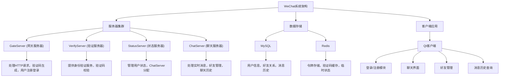

# WeChat 聊天系统

## 项目介绍

WeChat 聊天系统是一个基于分布式架构的即时通讯应用，包含服务器集群和跨平台客户端。该系统模仿了微信的核心功能，采用现代C++技术栈构建，支持用户注册、登录、好友管理、即时消息通信等功能。项目采用微服务架构设计，确保系统的高可用性、可扩展性和可维护性。

## 项目结构图

## 项目架构

### 服务器架构

WeChat 系统采用微服务架构，将不同功能拆分为独立的服务，通过gRPC和HTTP进行通信：

1. **GateServer** - 网关服务器
   - 处理HTTP请求
   - 用户注册与登录
   - 验证码生成与发送
   - 使用Boost.Beast实现HTTP服务器

2. **VerifyServer** - 验证服务器
   - 验证码验证
   - 提供gRPC接口供其他服务调用
   - Redis缓存验证码

3. **StatusServer** - 状态服务器
   - 用户状态管理
   - ChatServer负载均衡
   - Token认证与验证
   - gRPC服务提供

4. **ChatServer** - 聊天服务器
   - 实时消息处理
   - 好友关系管理
   - 消息历史记录存储
   - 使用Boost.Asio实现TCP长连接

### 通信协议

- 服务间通信：gRPC (Protobuf)
- 客户端与网关通信：HTTP
- 客户端与聊天服务器通信：自定义TCP协议

### 数据存储

- **MySQL**：存储用户信息、好友关系、消息历史等持久化数据
- **Redis**：存储验证码、Token、临时会话信息等需要高速访问的数据

### 客户端架构

客户端采用Qt框架开发，实现跨平台支持：

- 使用Qt的信号槽机制实现异步通信
- 采用单例模式管理全局资源
- 基于TCP长连接实现消息的实时收发
- HTTP请求处理用户认证和注册

## 项目功能

### 用户管理
- 账号注册（用户名、密码、邮箱）
- 邮箱验证码验证
- 账号/邮箱登录
- 密码重置功能

### 好友管理
- 搜索用户
- 发送好友请求
- 接受/拒绝好友申请
- 好友列表显示

### 即时通讯
- 实时文本消息收发
- 消息历史记录查询
- 好友在线状态显示
- 未读消息提醒

### 系统功能
- 聊天服务器负载均衡
- 用户身份验证与授权
- 数据安全性保障
- 分布式服务自动发现与恢复

## 项目优势

### 技术优势
1. **高性能架构**：采用C++开发，结合Boost.Asio实现高并发处理能力
2. **分布式设计**：服务解耦，单个服务故障不影响整体系统运行
3. **可扩展性**：各服务可独立扩展，根据负载动态调整
4. **数据安全**：密码加密存储，通信加密，令牌验证
5. **代码优化**：使用现代C++特性，设计模式应用，提高代码质量

### 功能优势
1. **实时通信**：基于TCP长连接，保证消息实时性和可靠性
2. **跨平台支持**：Qt客户端支持Windows、Linux、MacOS
3. **用户体验**：简洁直观的界面设计，操作流程优化
4. **功能完整**：覆盖即时通讯系统的核心功能
5. **鲁棒性**：完善的错误处理和异常机制

## 技术栈

### 后端
- C++ 17
- Boost (Beast, Asio)
- gRPC & Protobuf
- MySQL Connector/C++
- Redis (hiredis)
- nlohmann/json

### 前端
- Qt 6
- C++
- QSS样式表
- Qt网络模块

### 构建工具
- CMake
- Ninja
- vcpkg (依赖管理)

## 联系方式

如有任何问题或建议，欢迎提交 Issue 或通过以下方式联系我：

- Email: 1989601704@qq.com

,

