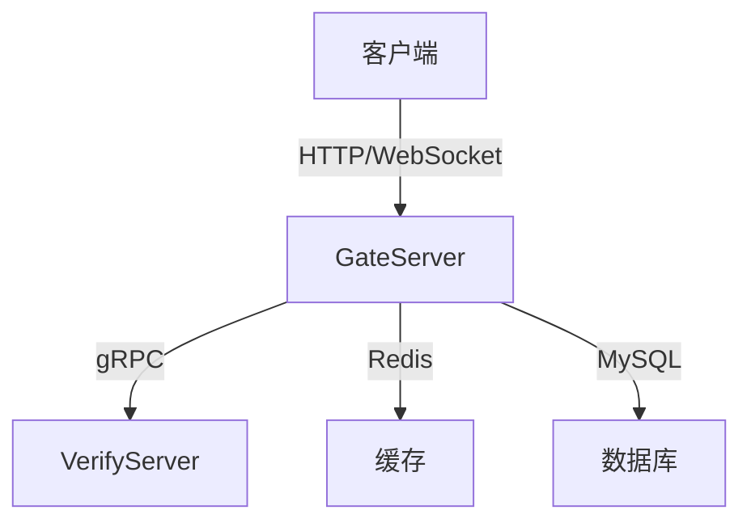

# WeChat C++项目说明

## 一、系统架构设计



## 二、功能模块规划

### 1. GateServer (C++)
- 登录验证模块
- 数据库操作模块
- 缓存管理模块
- WebSocket服务模块

### 2. VerifyServer (Node.js)
- 验证码生成模块
- 邮件发送模块
- gRPC服务模块

### 3. Client (Qt)
- 登录界面模块
- 主窗口模块
- 网络通信模块

## 三、接口定义

### HTTP接口
```typescript


interface LoginRequest {
    username: string;
    password: string;
    captcha: string;
}

interface RegisterRequest {
    username: string;
    password: string;
    email: string;
    captcha: string;
}

interface ApiResponse<T> {
    code: number;
    message: string;
    data: T;
}
```

### gRPC接口
```protobuf


service VerifyService {
    rpc GenerateCaptcha (CaptchaRequest) returns (CaptchaResponse);
    rpc VerifyCaptcha (VerifyRequest) returns (VerifyResponse);
    rpc SendEmail (EmailRequest) returns (EmailResponse);
}
```

## 四、数据库设计

```sql


CREATE TABLE users (
    id BIGINT PRIMARY KEY AUTO_INCREMENT,
    username VARCHAR(50) UNIQUE NOT NULL,
    password VARCHAR(256) NOT NULL,
    email VARCHAR(100) UNIQUE NOT NULL,
    created_at TIMESTAMP DEFAULT CURRENT_TIMESTAMP
);

CREATE TABLE messages (
    id BIGINT PRIMARY KEY AUTO_INCREMENT,
    sender_id BIGINT NOT NULL,
    receiver_id BIGINT NOT NULL,
    content TEXT NOT NULL,
    send_time TIMESTAMP DEFAULT CURRENT_TIMESTAMP
);
```

## 五、项目结构

```
WeChat/
├── GateServer/
│   ├── src/
│   ├── include/
│   └── CMakeLists.txt
├── VerifyServer/
│   ├── src/
│   └── package.json
├── Client/
│   ├── src/
│   └── WeChat.pro
├── proto/
├── docs/
└── README.md
```

## 六、开发环境需求

### 开发工具
- Visual Studio 2022
- Visual Studio Code
- Qt Creator
- Redis Desktop Manager
- MySQL Workbench

### 依赖项
```powershell
# Windows依赖安装命令
vcpkg install boost:x64-windows
vcpkg install grpc:x64-windows
vcpkg install openssl:x64-windows
vcpkg install mysql-connector-cpp:x64-windows
vcpkg install redis-plus-plus:x64-windows
```

## 七、构建与部署

### 编译命令
```bash
# GateServer
mkdir build && cd build
cmake -DCMAKE_TOOLCHAIN_FILE=[vcpkg root]/scripts/buildsystems/vcpkg.cmake ..
cmake --build . --config Release

# VerifyServer
cd VerifyServer
npm install
npm run build

# Client
cd Client
qmake
nmake
```

## 八、测试计划

- 单元测试：使用Google Test
- 接口测试：使用Postman
- 压力测试：使用Apache JMeter
- 端到端测试：自动化UI测试

## 九、时间规划

1. 架构设计与环境搭建 (1周)
2. 基础功能开发 (2周)
3. 核心功能实现 (2周)
4. 测试与优化 (1周)
5. 部署上线 (1周)
