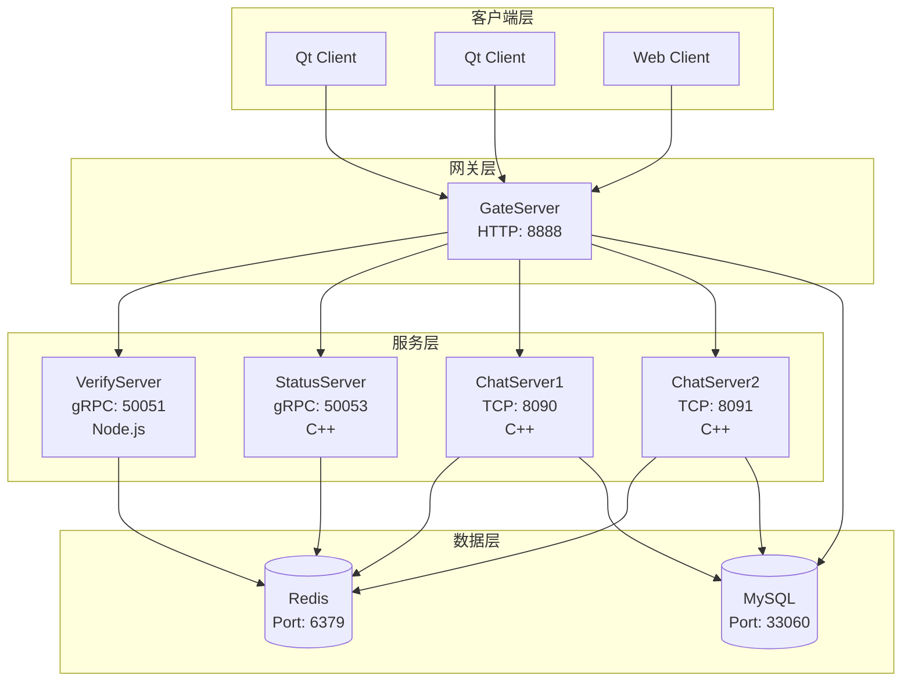
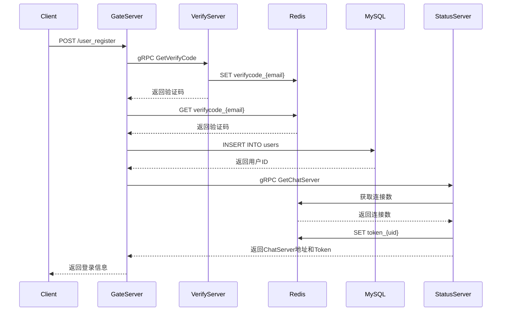
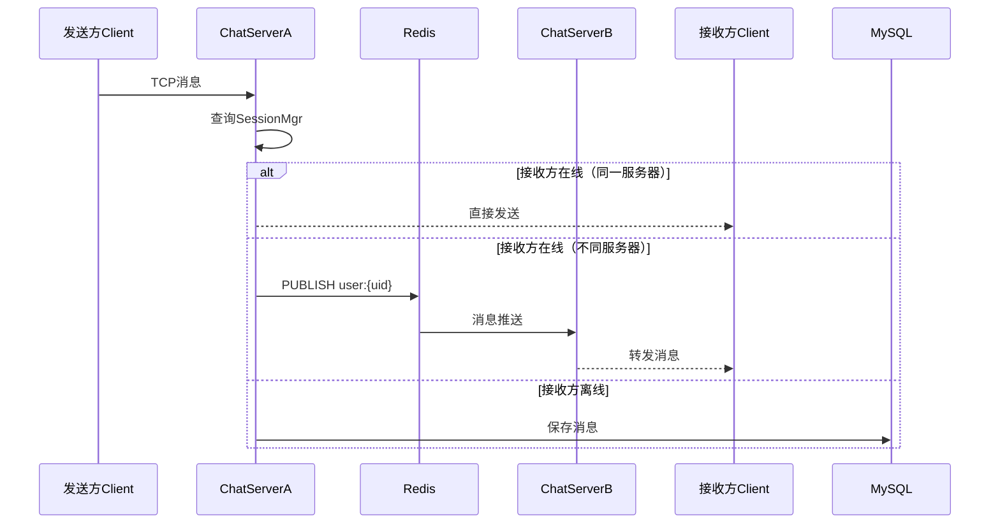
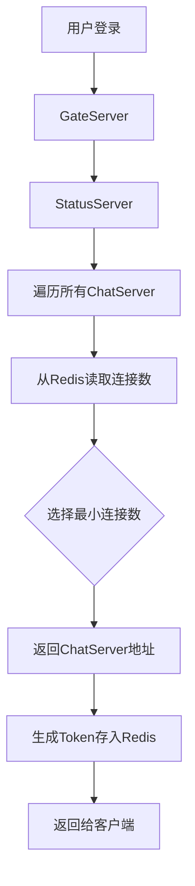

# 分布式聊天系统

基于 C++、Boost.asio、gRPC、Redis、MySQL 构建的高性能分布式即时通讯系统。

[License]: https://opensource.org/licenses/MIT
[Language]: https://isocpp.org/

[](https://opensource.org/licenses/MIT)
[](https://isocpp.org/)
[](https://github.com/BeyondESH)

---

## 项目简介

本项目是一个高性能分布式聊天系统，采用微服务架构设计，支持单聊、群聊、好友管理等核心功能。系统具备以下特点：

- **高并发**: 基于 Boost.Asio 异步IO模型，支持百万级并发连接
- **分布式**: 多ChatServer节点部署，Redis Pub/Sub实现跨节点消息路由
- **高可用**: 基于Redis的负载均衡和状态管理
- **实时性**: 毫秒级消息延迟，支持心跳保活机制
- **可扩展**: 模块化设计，易于扩展新功能

---

## 架构设计

### 系统架构图


```mermaid
graph TB
    subgraph 客户端层
        QT1[Qt Client]
        QT2[Qt Client]
        WEB[Web Client]
    end

    subgraph 网关层
        GATE[GateServer\nHTTP: 8888]
    end

    subgraph 服务层
        VERIFY[VerifyServer\ngRPC: 50051\nNode.js]
        STATUS[StatusServer\ngRPC: 50053\nC++]
        CHAT1[ChatServer1\nTCP: 8090\nC++]
        CHAT2[ChatServer2\nTCP: 8091\nC++]
    end

    subgraph 数据层
        MYSQL[(MySQL\nPort: 33060)]
        REDIS[(Redis\nPort: 6379)]
    end

    QT1 --> GATE
    QT2 --> GATE
    WEB --> GATE
    
    GATE --> VERIFY
    GATE --> STATUS
    GATE --> CHAT1
    GATE --> CHAT2
    
    STATUS --> REDIS
    VERIFY --> REDIS
    CHAT1 --> REDIS
    CHAT2 --> REDIS
    
    CHAT1 --> MYSQL
    CHAT2 --> MYSQL
    GATE --> MYSQL
```

### 核心组件职责

| 组件 | 语言 | 端口 | 核心职责 |
|------|------|------|----------|
| **GateServer** | C++ | 8888 | HTTP网关，处理注册、登录、验证码请求 |
| **StatusServer** | C++ | 50053 | gRPC服务，管理ChatServer负载均衡和Token验证 |
| **ChatServer** | C++ | 8090/8091 | TCP聊天服务器，处理消息路由和业务逻辑 |
| **VerifyServer** | Node.js | 50051 | gRPC服务，发送邮箱验证码 |

### 用户注册登录流程


```mermaid
sequenceDiagram
    participant Client as Client
    participant Gate as GateServer
    participant Verify as VerifyServer
    participant Redis as Redis
    participant MySQL as MySQL
    participant Status as StatusServer

    Client->>Gate: POST /user_register
    Gate->>Verify: gRPC GetVerifyCode
    Verify->>Redis: SET verifycode_{email}
    Verify-->>Gate: 返回验证码
    Gate->>Redis: GET verifycode_{email}
    Redis-->>Gate: 返回验证码
    Gate->>MySQL: INSERT INTO users
    MySQL-->>Gate: 返回用户ID
    Gate->>Status: gRPC GetChatServer
    Status->>Redis: 获取连接数
    Redis-->>Status: 返回连接数
    Status->>Redis: SET token_{uid}
    Status-->>Gate: 返回ChatServer地址和Token
    Gate-->>Client: 返回登录信息
```

### 消息发送流程


```mermaid
sequenceDiagram
    participant Sender as 发送方Client
    participant ChatA as ChatServerA
    participant Redis as Redis
    participant ChatB as ChatServerB
    participant Receiver as 接收方Client

    Sender->>ChatA: TCP消息
    ChatA->>ChatA: 查询SessionMgr
    alt 接收方在线（同一服务器）
        ChatA-->>Receiver: 直接发送
    else 接收方在线（不同服务器）
        ChatA->>Redis: PUBLISH user:{uid}
        Redis->>ChatB: 消息推送
        ChatB-->>Receiver: 转发消息
    else 接收方离线
        ChatA->>MySQL: 保存消息
    end
```

---

## 功能特性

### 已实现功能

| 功能模块 | 功能描述 | 技术实现 |
|----------|----------|----------|
| 用户管理 | 账号注册、邮箱登录、密码重置 | MySQL持久化 + Redis缓存 |
| 单聊 | 实时一对一聊天 | TCP长连接 + Redis Pub/Sub跨机路由 |
| 群聊 | 创建群组、管理成员、群消息分发 | MySQL群组表 + 成员列表查询 |
| 好友系统 | 添加好友、处理请求、好友列表 | 双向好友关系表 |
| 在线状态 | 实时显示好友在线状态 | Redis Hash存储 |
| 消息历史 | 本地缓存 + 服务端存储 | MySQL消息表 |
| 心跳机制 | 连接状态检测、自动重连 | Boost.Asio定时器 |
| 负载均衡 | 基于连接数的动态分配 | Redis存储连接数 |
| Token认证 | 一次性登录Token | Redis + 5分钟TTL |

### 核心技术亮点

1. **TCP消息协议**: TLV格式（msg_id: 2字节 + msg_size: 2字节 + msg_body: N字节）
2. **Actor模型**: 多线程任务队列，UID哈希分发，保证同一用户消息顺序
3. **Redis Pub/Sub**: 跨服务器消息路由，支持水平扩展
4. **连接池**: MySQL和Redis连接池管理，复用连接
5. **优雅退出**: 信号处理和资源清理，保证数据一致性

---

## 技术栈

| 分类 | 技术 | 版本 | 说明 |
|------|------|------|------|
| 语言 | C++ | 17 | 高性能服务端开发 |
| 语言 | Node.js | 18+ | 验证码服务 |
| 网络框架 | Boost.Asio | 1.82+ | 异步IO |
| RPC框架 | gRPC | 1.50+ | 服务间通信 |
| 数据库 | MySQL | 8.0+ | 用户数据、消息存储 |
| 缓存 | Redis | 7.0+ | 在线状态、Token、消息路由 |
| 构建工具 | CMake | 3.20+ | 跨平台构建 |
| JSON处理 | nlohmann/json | 3.11+ | 轻量级JSON库 |
| 客户端 | Qt | 6.0+ | 桌面客户端 |

---

## 快速开始

### 环境要求

- 操作系统: Windows 10+ / Linux (Ubuntu 20.04+)
- MySQL: 8.0+
- Redis: 7.0+
- Node.js: 18+
- CMake: 3.20+
- Boost: 1.82+
- gRPC: 1.50+

### 数据库配置

1. 创建MySQL数据库:
```sql
CREATE DATABASE wechat CHARACTER SET utf8mb4 COLLATE utf8mb4_unicode_ci;
```

2. 导入表结构:
```bash
mysql -u root -p wechat < ChatServer/database/chat_tables.sql
```

3. 配置Redis:
```bash
redis-cli config set requirepass "121105"
redis-cli config set save ""
```

### 服务启动顺序

```bash
# 1. 启动Redis（后台运行）
redis-server --daemonize yes

# 2. 启动MySQL
mysqld --daemonize

# 3. 启动VerifyServer
cd VerifyServer
npm install
node server.js

# 4. 启动StatusServer
cd StatusServer/build
./StatusServer

# 5. 启动GateServer
cd GateServer/build
./GateServer

# 6. 启动ChatServer（可启动多个实例）
cd ChatServer/build
./ChatServer
```

### 客户端连接

1. 编译Qt客户端:
```bash
cd qt/WeChat
mkdir build && cd build
qmake ..
make
```

2. 运行客户端:
```bash
./WeChat
```

3. 连接服务器:
- HTTP网关: http://localhost:8888
- 登录后自动连接到分配的ChatServer

---

## API文档

### HTTP API

| 接口 | 方法 | 参数 | 描述 |
|------|------|------|------|
| /get_varifycode | POST | email: 邮箱地址 | 获取注册验证码 |
| /user_register | POST | email, verifyCode, user, password | 用户注册 |
| /reset_password | POST | email, verifyCode, password | 重置密码 |
| /account_login | POST | user, password | 账号登录 |
| /email_login | POST | email, password | 邮箱登录 |

请求示例:
```json
// POST /account_login
{
    "user": "testuser",
    "password": "123456"
}

// 响应示例
{
    "error": 0,
    "uid": 1,
    "token": "uuid-token",
    "host": "127.0.0.1",
    "port": 8090
}
```

### TCP消息协议

消息格式:
```
+--------+--------+----------------+
| msg_id | msg_len| msg_body       |
| (2B)   | (2B)   | (N bytes)      |
+--------+--------+----------------+
```

消息ID列表:

| ID | 消息类型 | 描述 |
|----|----------|------|
| 1005 | ID_CHAT_LOGIN | 聊天登录请求 |
| 1006 | ID_CHAT_LOGIN_RSP | 聊天登录响应 |
| 1020 | ID_HEARTBEAT_PING | 心跳请求 |
| 1021 | ID_HEARTBEAT_PONG | 心跳响应 |
| 1017 | ID_TEXT_CHAT_MSG_REQ | 单聊消息请求 |
| 1018 | ID_TEXT_CHAT_MSG_RSP | 单聊消息响应 |
| 1019 | ID_NOTIFY_TEXT_CHAT_MSG_REQ | 单聊消息通知 |
| 1028 | ID_IMAGE_CHAT_MSG_REQ | 单聊图片消息请求 |
| 1029 | ID_IMAGE_CHAT_MSG_RSP | 单聊图片消息响应 |
| 1030 | ID_NOTIFY_IMAGE_CHAT_MSG_REQ | 单聊图片消息通知 |
| 1022 | ID_FRIEND_LIST_REQ | 获取好友列表 |
| 1023 | ID_FRIEND_LIST_RSP | 好友列表响应 |
| 1007 | ID_SEARCH_USER_REQ | 搜索用户 |
| 1008 | ID_SEARCH_USER_RSP | 搜索用户响应 |
| 1009 | ID_ADD_FRIEND_REQ | 添加好友请求 |
| 1010 | ID_ADD_FRIEND_RSP | 添加好友响应 |
| 1013 | ID_AUTH_FRIEND_REQ | 好友请求授权 |
| 1014 | ID_AUTH_FRIEND_RSP | 授权响应 |
| 1024 | ID_GET_CHAT_HISTORY_REQ | 获取聊天历史 |
| 1025 | ID_GET_CHAT_HISTORY_RSP | 聊天历史响应 |
| 2001 | ID_CREATE_GROUP_REQ | 创建群组请求 |
| 2002 | ID_CREATE_GROUP_RSP | 创建群组响应 |
| 2003 | ID_ADD_GROUP_MEMBER_REQ | 添加群成员 |
| 2004 | ID_ADD_GROUP_MEMBER_RSP | 添加群成员响应 |
| 2007 | ID_GROUP_CHAT_MSG_REQ | 群消息请求 |
| 2008 | ID_GROUP_CHAT_MSG_RSP | 群消息响应 |
| 2009 | ID_NOTIFY_GROUP_CHAT_MSG_REQ | 群消息通知 |
| 2016 | ID_GROUP_IMAGE_CHAT_MSG_REQ | 群图片消息请求 |
| 2017 | ID_GROUP_IMAGE_CHAT_MSG_RSP | 群图片消息响应 |
| 2018 | ID_NOTIFY_GROUP_IMAGE_CHAT_MSG_REQ | 群图片消息通知 |
| 2010 | ID_GET_GROUP_LIST_REQ | 获取群列表 |
| 2011 | ID_GET_GROUP_LIST_RSP | 群列表响应 |
| 2012 | ID_GET_GROUP_MEMBERS_REQ | 获取群成员 |
| 2013 | ID_GET_GROUP_MEMBERS_RSP | 群成员响应 |

单聊消息示例:
```json
// 请求 (ID_TEXT_CHAT_MSG_REQ = 1017)
{
    "fromUid": 1,
    "toUid": 2,
    "content": "Hello World",
    "time": "2024-01-01 12:00:00"
}

// 通知 (ID_NOTIFY_TEXT_CHAT_MSG_REQ = 1019)
{
    "messageId": 1001,
    "fromUid": 1,
    "fromName": "张三",
    "fromAvatar": "",
    "content": "Hello World",
    "time": "2024-01-01 12:00:00"
}

// 图片消息请求 (ID_IMAGE_CHAT_MSG_REQ = 1028)
{
    "fromUid": 1,
    "toUid": 2,
    "content": "data:image/png;base64,iVBORw0KGgoAAAANSUhEUgAA...",
    "imageType": "png",
    "width": 800,
    "height": 600,
    "fileSize": 102400
}

// 图片消息通知 (ID_NOTIFY_IMAGE_CHAT_MSG_REQ = 1030)
{
    "messageId": 1002,
    "fromUid": 1,
    "fromName": "张三",
    "fromAvatar": "",
    "content": "data:image/png;base64,iVBORw0KGgoAAAANSUhEUgAA...",
    "imageType": "png",
    "width": 800,
    "height": 600,
    "fileSize": 102400,
    "time": "2024-01-01 12:00:00"
}
```

### gRPC服务

StatusService:
```protobuf
service StatusService {
    rpc GetChatServer(GetChatServerReq) returns (GetChatServerRsp);
    rpc CheckToken(CheckTokenReq) returns (CheckTokenRsp);
}

message GetChatServerReq {
    int32 uid = 1;
}

message GetChatServerRsp {
    int32 error = 1;
    string host = 2;
    string port = 3;
    string token = 4;
}

message CheckTokenReq {
    int32 uid = 1;
    string token = 2;
}

message CheckTokenRsp {
    int32 error = 1;
    int32 uid = 2;
    string token = 3;
}
```

VerifyService:
```protobuf
service VerifyService {
    rpc GetVerifyCode(GetVerifyReq) returns (GetVerifyRsp);
}

message GetVerifyReq {
    string email = 1;
}

message GetVerifyRsp {
    string email = 1;
    int32 error = 2;
    string code = 3;
}
```

---

## 数据结构

### Redis数据结构

| Key | 类型 | 描述 | TTL |
|-----|------|------|-----|
| verifycode_{email} | String | 邮箱验证码 | 600秒 |
| token_{uid} | String | 登录Token | 300秒 |
| online_users | Hash | 在线用户→服务器映射 | - |
| chatserver:{name}:connections | Hash | 服务器连接数 | - |

### MySQL表结构

users表:
| 字段 | 类型 | 说明 |
|------|------|------|
| uid | INT | 用户唯一ID |
| name | VARCHAR(64) | 用户名 |
| email | VARCHAR(128) | 邮箱 |
| password | VARCHAR(255) | 加盐加密密码 |
| avatar | VARCHAR(255) | 头像URL |
| status | VARCHAR(255) | 个性签名 |
| created_at | TIMESTAMP | 创建时间 |

friendships表:
| 字段 | 类型 | 说明 |
|------|------|------|
| id | INT | 主键 |
| user1_id | INT | 用户1ID（较小ID） |
| user2_id | INT | 用户2ID（较大ID） |
| friendship_date | DATETIME | 建立时间 |

friend_requests表:
| 字段 | 类型 | 说明 |
|------|------|------|
| id | INT | 主键 |
| from_uid | INT | 请求发起者 |
| to_uid | INT | 请求接收者 |
| message | TEXT | 请求消息 |
| request_time | DATETIME | 请求时间 |
| response_time | DATETIME | 响应时间 |
| status | ENUM | pending/accepted/rejected |

messages表:
| 字段 | 类型 | 说明 |
|------|------|------|
| id | BIGINT | 消息ID |
| from_uid | INT | 发送者ID |
| to_uid | INT | 接收者ID（单聊）/群组ID（群聊） |
| content | TEXT | 消息内容 |
| send_time | DATETIME(3) | 发送时间 |
| msg_type | TINYINT | 消息类型（0:文字,1:图片,2:语音,3:视频,4:文件） |
| status | TINYINT | 状态（0:未读,1:已读,2:已撤回） |
| chat_type | TINYINT | 聊天类型（0:单聊,1:群聊） |

groups表:
| 字段 | 类型 | 说明 |
|------|------|------|
| group_id | BIGINT | 群组ID |
| name | VARCHAR(64) | 群组名称 |
| owner_uid | INT | 群主ID |
| avatar | VARCHAR(255) | 群组头像 |
| created_at | DATETIME | 创建时间 |

group_members表:
| 字段 | 类型 | 说明 |
|------|------|------|
| group_id | BIGINT | 群组ID |
| uid | INT | 用户ID |
| role | ENUM | owner/admin/member |
| joined_at | DATETIME | 加入时间 |

---

## 核心机制

### 负载均衡策略


```mermaid
flowchart TD
    A[用户登录] --> B[GateServer]
    B --> C[StatusServer]
    C --> D[遍历所有ChatServer]
    D --> E[从Redis读取连接数]
    E --> F{选择最小连接数}
    F --> G[返回ChatServer地址]
    G --> H[生成Token存入Redis]
    H --> I[返回给客户端]
```

1. StatusServer维护所有ChatServer的连接数（存储在Redis）
2. 新用户登录时，StatusServer遍历所有ChatServer，选择连接数最少的服务器
3. 连接数通过Redis的HINCRBY/HDECRBY操作实时更新
4. 支持多StatusServer节点，因为状态存储在Redis中

### 跨服务器消息路由

流程说明:
1. 用户登录时订阅自己的频道 user:{uid}
2. 发送消息时先查询本地SessionMgr
3. 本地存在则直接发送
4. 本地不存在则通过Redis发布到目标用户频道
5. 目标服务器订阅该频道后，接收消息并转发给客户端

### 心跳机制

- 客户端: 每隔30秒发送心跳包（ID_HEARTBEAT_PING）
- 服务器: 收到心跳后立即响应（ID_HEARTBEAT_PONG）
- 超时处理: 如果服务器60秒未收到心跳，断开连接并清理资源
- 断线重连: 客户端检测到超时后自动重连

---

## 性能测试

### 测试环境

| 配置 | 说明 |
|------|------|
| CPU | AMD 7745hx |
| 内存 | 16GB DDR4 |
| 网络 | 10Gbps |
| MySQL | 本地SSD |
| Redis | 本地 |

### 测试结果

| 测试项 | 结果 |
|--------|------|
| HTTP请求QPS | 18,500 req/s |
| TCP并发连接 | 100,000+ |
| 消息延迟 | < 50ms |
| 消息吞吐 | 10,000 msg/s |

wrk压测结果:
```bash
wrk -t12 -c1000 -d120s --latency -s post.lua http://127.0.0.1:8080

Thread Stats   Avg      Stdev     Max   +/- Stdev
  Latency     7.12ms    5.43ms  82.34ms   83.2%
  Req/Sec     1.54k   288.42     2.48k    74.42%

Latency Distribution
  50%    5.8ms
  75%    8.9ms
  90%   15.2ms
  99%   35.4ms

Requests/sec:  18500.42
Transfer/sec:   22.1MB
```

---

## 开发指南

### 编译命令

```bash
# ChatServer
mkdir -p ChatServer/build && cd ChatServer/build
cmake .. -DCMAKE_BUILD_TYPE=Release
make -j$(nproc)

# GateServer
mkdir -p GateServer/build && cd GateServer/build
cmake .. -DCMAKE_BUILD_TYPE=Release
make -j$(nproc)

# StatusServer
mkdir -p StatusServer/build && cd StatusServer/build
cmake .. -DCMAKE_BUILD_TYPE=Release
make -j$(nproc)
```

### 配置文件

各服务器使用 config.ini 配置:

```ini
[GateServer]
host=0.0.0.0
port=8888

[VerifyServer]
host=localhost
port=50051

[Mysql]
user=root
host=localhost
port=33060
password=121105
schema=wechat

[Redis]
host=localhost
port=6379
password=121105

[StatusServer]
host=localhost
port=50053

[ChatServer]
number=2

[ChatServer1]
name=ChatServer1
host=127.0.0.1
port=8090

[ChatServer2]
name=ChatServer2
host=127.0.0.1
port=8091
```

### 调试技巧

1. 启用调试模式:
```bash
cmake .. -DCMAKE_BUILD_TYPE=Debug
```

2. 查看日志:
```bash
tail -f /var/log/chatserver.log
```

3. Redis监控:
```bash
redis-cli monitor
```

---

## 贡献指南

欢迎贡献代码！请遵循以下流程：

1. Fork项目
2. 创建分支: git checkout -b feature/your-feature
3. 提交代码: git commit -m "Add feature: xxx"
4. 推送到分支: git push origin feature/your-feature
5. 创建Pull Request

### 代码规范

- 遵循 C++17 标准
- 使用 Google 代码风格
- 函数名使用 camelCase
- 类名使用 PascalCase
- 变量名使用 snake_case
- 添加适当的注释

### 提交信息规范

```
类型: 简短描述

详细描述（可选）

Fixes: #issue-number
```

类型:
- feat: 新功能
- fix: 修复bug
- docs: 文档更新
- style: 代码格式
- refactor: 代码重构
- test: 测试
- chore: 构建/工具

---

## 许可证

MIT License

---

## 联系方式

如有问题或建议，欢迎提交 Issue 或 Pull Request！

QQ邮箱: 1989601704@qq.com

微信: 1989601704

---

如果这个项目对你有帮助，请给个Star！
